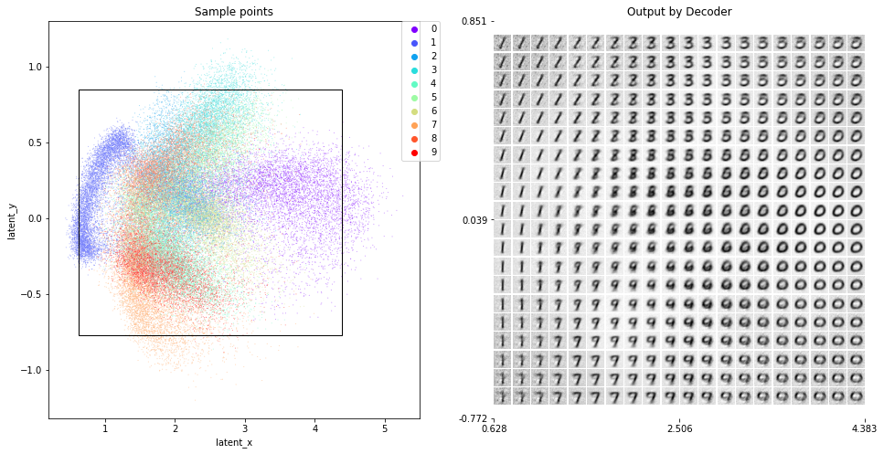

# Variational Auto Encoder

**blog post**

- https://blog.joonas.io/216

**kaggle**

- https://www.kaggle.com/code/joonasyoon/mnist-vae-variational-auto-encoder-visualization

**jupyter notebook**

- [VAE.ipynb](VAE.ipynb)

## Train

## Sample images

