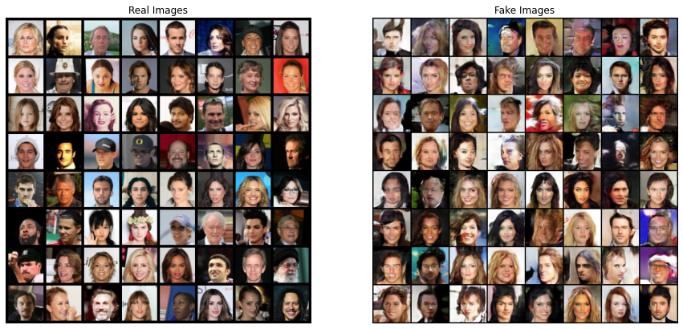

# DCGAN

Deep Convolutional Generative Adversarial Networks

Most of the code for DCGAN, in notebook, came from [PyTorch Tutorial](https://pytorch.org/tutorials/beginner/dcgan_faces_tutorial.html) and you can see also this at [github repository](https://github.com/pytorch/examples/tree/main/dcgan)

**jupyter notebook**

- [DCGAN.ipynb](DCGAN.ipynb)

## Train

## Result

## Walking in the latent space

