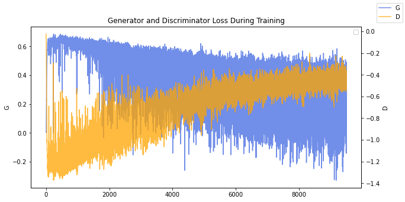
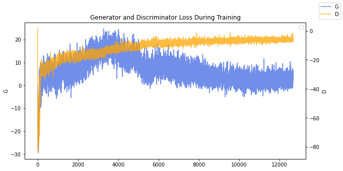

# WGAN

## WGAN-CP

**paper**

- Wasserstein GAN - https://arxiv.org/pdf/1701.07875.pdf

**blog post**

- https://blog.joonas.io/218

**jupyter notebook**

- [WGAN.ipynb](WGAN.ipynb)

### Loss graph

## WGAN-GP

**paper**

- Improved Training of Wasserstein GANs - https://arxiv.org/pdf/1704.00028.pdf

**blog post**

- https://blog.joonas.io/218

**jupyter notebook**

- [WGAN-GP.ipynb](wgan-gp.ipynb)

**Kaggle**

- https://www.kaggle.com/code/joonasyoon/wgan-gp-with-celeba

### Loss graph

during train with CelebA dataset

### CelebA Dataset

### LSUN Dataset

